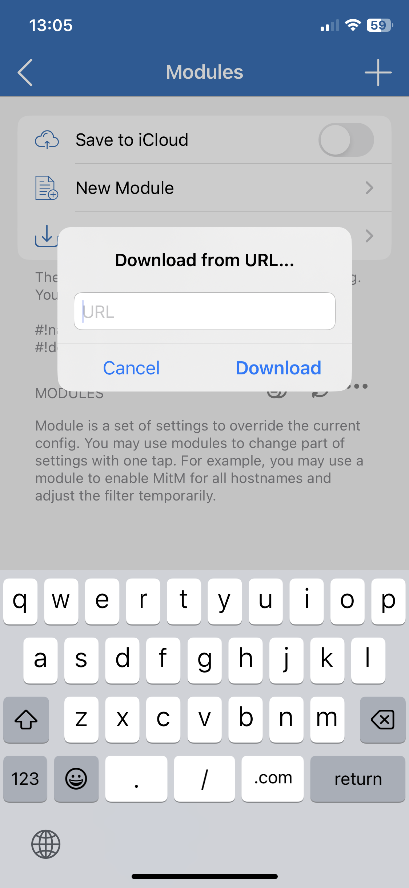

# shadowrocket-bypass

List with rules for domains that don't allow public cloud CIDRs / public VPNs.

## Setup

In Shadowrocket go to `Config -> Modules -> +`, you should see this:



Copy and paste this URL to list:

```
https://raw.githubusercontent.com/strlght/shadowrocket-bypass/main/list.conf
```

Then tap on module to enable it, and you're all done.

